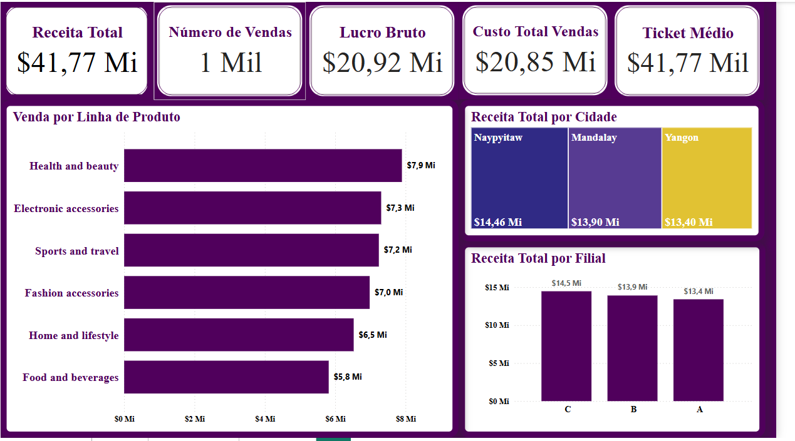
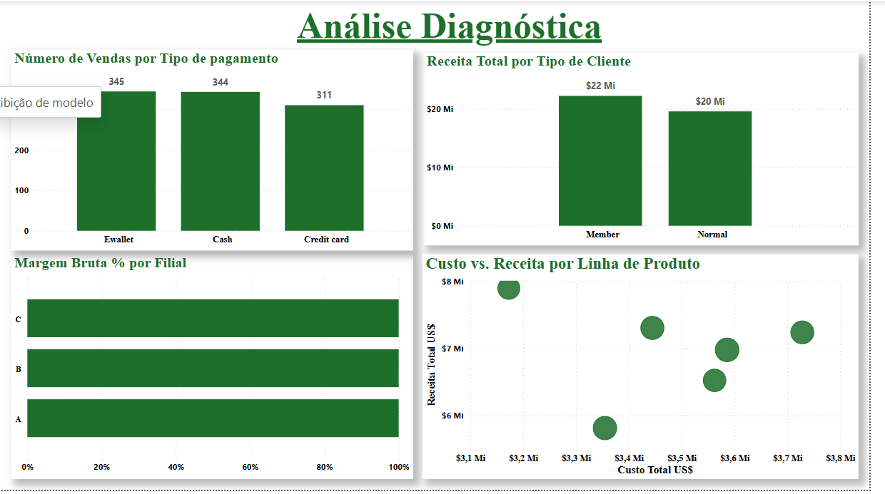
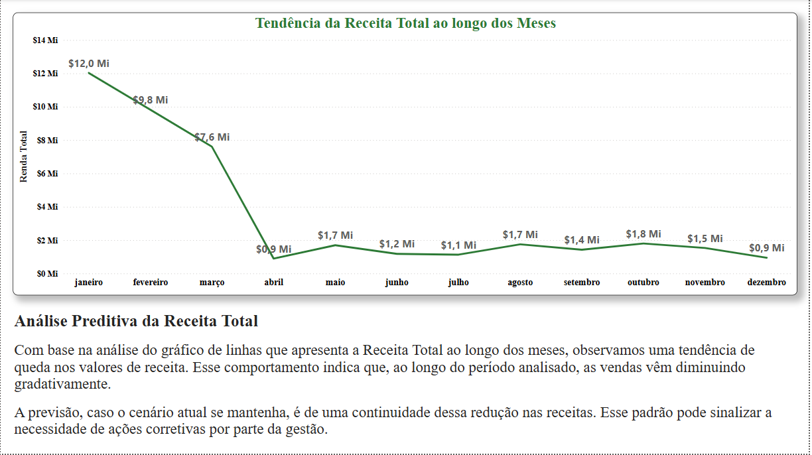

# IAN-Store Analytics Dashboard

[](https://powerbi.microsoft.com/)  


## Descrição

Este repositório contém o projeto **IAN-Store Analytics Dashboard**, o objetivo deste projeto é demonstrar a aplicação prática de técnicas de análise descritiva, diagnóstica e preditiva em um cenário real de vendas de uma loja fictícia chamada **IAN-Store**. Utilizando o Power BI, criamos um dashboard interativo que suporta a tomada de decisões estratégicas por meio de visualizações e métricas relevantes.

-----------------------------------------------------------------------------------

## 📝 Conteúdo do Projeto

### 1. Dataset de Vendas
- O arquivo `DataSet/dataset-IAN-Store.csv` contém todas as transações de vendas com as seguintes colunas:
  - **IDfatura**, **Filial**, **Cidade**, **TipoCliente**, **Gênero**, **LinhaProduto**, **precoUnitario**, **Quantidade**, **Imposto5%**, **Total**: Valor final pago pelo cliente (incluindo impostos). **RendaBruta**, 
  **PercentualMargemBruta**, **avaliacao**, **Data**, **Hora**, **TipoPagamento**.

### 2. Dashboard Power BI
O arquivo `DashboardPowerBI/AnaliseStore.pbix` contém:
- **Página “KPIs”**  
  - 6 Cartões (Cards) exibindo os principais indicadores (Receita Total, Número de Vendas, Lucro Bruto, Custo Total, Ticket Médio e Margem Bruta %).
  

- **Página “Descritiva”**  
  - Gráficos de barras horizontais com **Receita por Linha de Produto**.  
  - **Treemap** de Receita por Cidade.  
  - Gráfico de barras verticais com Receita por Filial.  
  - Gráficos adicionais para **Método de Pagamento** e **Avaliação Média**.
  

- **Página “Diagnóstica”**  
  - Gráfico de barras com **Número de Vendas por Tipo de Pagamento**.  
  - Gráfico de colunas com **Receita Total por Tipo de Cliente**.  
  - Gráfico de barras horizontais com **Margem Bruta % por Filial**.  
  - Gráfico de dispersão (**Scatter Plot**) de **Custo vs. Receita por Linha de Produto**.
  

- **Página “Preditiva”**  
  - Gráfico de linhas mostrando a **Tendência da Receita Total ao longo dos meses**.  
  - Comentário de análise preditiva escrito diretamente no relatório.
  

---

## 🚀 Como Executar

1. **Clone este repositório:**
   ```bash
   git clone https://github.com/ThabataRodrigues/Analise-Store

Abra o Power BI Desktop (versão 2.87 ou superior recomendada).

Carregue o arquivo

Vá em File > Open e selecione IAN-Store_Analytics.pbix.

Interaja com o Dashboard

Utilize os slicers (Data, TipoCliente, LinhaProduto) para filtrar as visualizações.

Explore as páginas “KPIs”, “Descritiva”, “Diagnóstica” e “Preditiva”.

-----------------------------------------------------------------------------------
🔧 Ferramentas e Tecnologias
Power BI Desktop (v2.87+):

Power Query (ETL): limpeza de dados, remoção de duplicatas, tratamento de nulos, formatação de colunas.

DAX (Data Analysis Expressions) para criação de medidas como ReceitaTotal, LucroBruto, CustoTotal, TicketMedio, MargemBrutaPct e AvaliacaoMedia.

Visualizações nativas (Cards, Bar/Column charts, Treemap, Scatter Plot, Line Chart) e interatividade com slicers.

Dataset em CSV.

🤝 Contribuição
Contribuições são bem-vindas! Sinta-se à vontade para abrir issues ou enviar pull requests.


